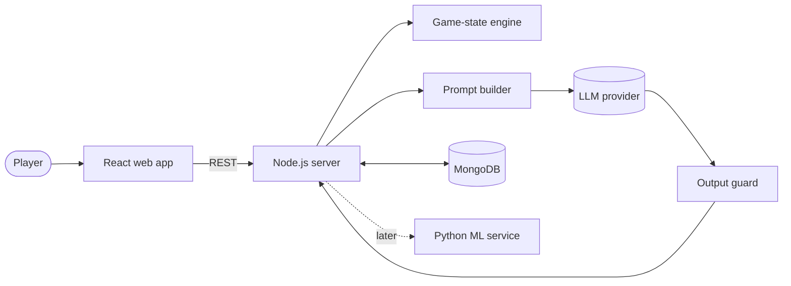

# patrickjane.simulator

> Everyone's lying. Only one of them did it.

A web-based detective game where you interrogate AI-driven suspects. Gather evidence, catch contradictions, and pressure the real culprit until they confess. The suspects talk through a large language model, but **the case logic is never left to chance**: a deterministic game-state engine decides what each suspect knows, what they are willing to admit, and when they break.

> **Status:** early development. APIs, schemas and folder layout may change.

---

## Table of Contents

- [How It Plays](#how-it-plays)
- [Design Philosophy](#design-philosophy)
- [The Three Layers](#the-three-layers)
- [Architecture](#architecture)
- [Tech Stack](#tech-stack)
- [Project Structure](#project-structure)
- [Data Model](#data-model)
- [Getting Started](#getting-started)
- [Writing a Case](#writing-a-case)
- [Roadmap](#roadmap)
- [Machine Learning Plan](#machine-learning-plan)
- [Disclaimer](#disclaimer)
- [Contributing](#contributing)
- [License](#license)

---

## How It Plays

1. **Pick a case.** Each case has a victim, a scene, and several suspects.
2. **Investigate.** Examine the scene and collect evidence: objects, records, witness statements.
3. **Interrogate.** Question suspects in free text. They answer in character, and they may lie.
4. **Confront.** Present evidence that contradicts a suspect's statement. Each successful confrontation weakens their composure.
5. **Accuse.** When you think you know who did it, make your accusation. Break the real culprit and they confess. Accuse the wrong person and the case goes cold.

The twist: **innocent suspects have secrets too.** One is hiding an affair, another is covering for a friend. Their lies make them look guilty. Pressure an innocent suspect hard enough and they will confess *their own secret*, not the murder. Telling those two kinds of guilt apart is the core of the game.

---

## Design Philosophy

**The LLM is the voice, not the brain.**

A language model left to improvise will contradict the case, confess too early, or invent clues that don't exist. So the model never decides anything that matters. It only turns decisions already made by the game-state engine into natural dialogue.

| Responsibility | Owned by |
| --- | --- |
| Who the culprit is, what really happened | Case file (ground truth) |
| Whether a statement contradicts evidence | Game-state engine |
| How much a suspect's composure drops | Game-state engine |
| Whether a suspect confesses, and to what | Game-state engine |
| What a suspect is allowed to reveal right now | Game-state engine |
| *How* the suspect phrases their answer | LLM |

This keeps every case **solvable, fair, and reproducible**, and makes the engine fully unit-testable without calling a model.

---

## The Three Layers

### Layer 1: Ground Truth

The immutable facts of the case, never sent to the client.

- The real culprit, motive, and method
- A true timeline for every suspect
- Each suspect's secrets (including innocent ones) and the lies they tell to protect them

### Layer 2: Evidence Graph

Every piece of evidence is a node linked to people, places, times, and statements. Edges are typed:

- `supports`: the evidence backs up a statement
- `contradicts`: the evidence breaks a statement
- `implicates`: the evidence points toward a person
- `reveals`: the evidence exposes a specific secret

A case has dozens of nodes at most, so the whole graph is loaded into memory per session.

### Layer 3: Suspect State

Tracked per suspect, per play session:

- **Composure**: how well the suspect is holding up (0 to 100)
- **Commitments**: statements the suspect has made and is now bound to
- **Confronted evidence**: what the player has already used against them
- **Revealed secrets**: what they have already admitted
- **Confession conditions**: the exact combination of evidence and low composure that triggers a confession. Only the culprit has a murder confession; innocents can only confess their own secrets.

---

## Architecture



### One interrogation turn

1. The player sends a message, optionally attaching a piece of evidence.
2. The server classifies the intent: question, confrontation, or accusation.
3. The engine checks for contradictions and updates the suspect's state.
4. The prompt builder assembles a prompt containing **only** what this suspect is allowed to say at this state.
5. The LLM generates the in-character reply.
6. The output guard rejects replies that leak ground truth beyond the suspect's permissions.
7. The turn, along with a snapshot of the state, is saved to the transcript log.

The server is **authoritative**: the client only ever receives what the player has legitimately discovered.

---

## Tech Stack

| Layer | Technology |
| --- | --- |
| Frontend | React, Tailwind CSS, Vite, TypeScript |
| Backend | Node.js, TypeScript, Express or Fastify |
| Database | MongoDB with Mongoose |
| Shared types | `zod` schemas in a shared workspace package |
| LLM | Hosted API during prototyping, swappable for a self-hosted model |
| ML (planned) | Python, FastAPI, PyTorch, sentence-transformers |
| Monorepo | pnpm workspaces |

---

## Project Structure

```
whodunit/
├── apps/
│   ├── web/                      # React + Tailwind frontend
│   │   └── src/
│   │       ├── pages/            # CaseSelect, Investigation, Interrogation, Verdict
│   │       ├── components/       # ChatPanel, EvidenceBoard, ComposureMeter, SuspectCard
│   │       ├── hooks/            # useSession, useInterrogation
│   │       └── api/              # Typed API client
│   │
│   └── server/                   # Node.js backend
│       └── src/
│           ├── engine/           # Pure game logic, no DB or LLM calls
│           │   ├── composure.ts
│           │   ├── contradiction.ts
│           │   ├── confession.ts
│           │   └── knowledge.ts
│           ├── llm/
│           │   ├── provider.ts       # Provider interface (API or self-hosted)
│           │   ├── promptBuilder.ts
│           │   └── guard.ts
│           ├── routes/           # /cases, /sessions, /interrogate, /accuse
│           ├── models/           # Mongoose schemas
│           └── services/         # Glue between engine, LLM and DB
│
├── packages/
│   └── shared/                   # Types and zod schemas used by web and server
│
├── services/
│   └── ml/                       # Planned Python ML service
│       ├── intent/
│       ├── retrieval/
│       └── finetune/
│
└── cases/                        # Case files in JSON, seeded into MongoDB
```

---

## Data Model

| Collection | Contents | Access |
| --- | --- | --- |
| `cases` | Ground truth, suspects, timeline, evidence graph | Read-only, server only |
| `sessions` | Player progress, discovered evidence, per-suspect state | Read/write |
| `transcripts` | Every turn with the state snapshot at that moment | Append-only |

The `transcripts` collection doubles as a training dataset for the planned self-hosted model.

---

## Getting Started

### Prerequisites

- Node.js 20 or later
- pnpm 9 or later
- MongoDB 7 or later (local or Atlas)
- An API key for an LLM provider

### Installation

```bash
git clone https://github.com/<your-username>/whodunit.git
cd whodunit
pnpm install
```

### Environment variables

Create `apps/server/.env`:

```env
PORT=3001
MONGODB_URI=mongodb://localhost:27017/whodunit
LLM_PROVIDER=api
LLM_API_KEY=your-key-here
LLM_MODEL=your-model-name
```

Create `apps/web/.env`:

```env
VITE_API_URL=http://localhost:3001
```

### Run

```bash
pnpm --filter server seed     # load case files into MongoDB
pnpm dev                      # start web and server together
```

The web app runs at `http://localhost:5173`.

### Test

```bash
pnpm test                     # engine unit tests run without any LLM calls
```

---

## Writing a Case

Cases live in `cases/` as JSON and are validated against the schema in `packages/shared`. A minimal outline:

```json
{
  "id": "case-001-manor",
  "title": "Death at Halvorsen Manor",
  "culprit": "suspect-butler",
  "suspects": [
    {
      "id": "suspect-butler",
      "name": "Edgar Pell",
      "trueTimeline": [],
      "secrets": [],
      "initialComposure": 80
    }
  ],
  "evidence": [
    {
      "id": "ev-muddy-boots",
      "description": "Boots with fresh garden mud by the back door",
      "edges": [
        { "type": "contradicts", "target": "stmt-butler-never-left-house" }
      ]
    }
  ],
  "confessionRules": []
}
```

Good cases follow three rules:

1. **Every suspect lies about something.** No one should be cleared just by being consistent.
2. **The culprit is provable.** There must be a chain of evidence that leads to them and only them.
3. **No dead ends.** Every innocent lie can be exposed and explained by evidence in the case.

---

## Roadmap

- [ ] Case file schema and validator
- [ ] Game-state engine with unit tests
- [ ] Interrogation API with a hosted LLM
- [ ] Interrogation room UI: chat, evidence board, composure meter
- [ ] First complete playable case
- [ ] Output guard against truth leaks
- [ ] Accusation and verdict screen
- [ ] Case editor for writing new cases
- [ ] Python ML service (see below)

---

## Machine Learning Plan

The project is also a hands-on path for learning ML end to end. Each stage replaces part of the pipeline with a model built in-house:

1. **Intent classifier.** Classify player messages (question, confrontation, accusation, small talk). A good first supervised-learning project.
2. **Evidence retrieval.** Use sentence embeddings to match free-text questions to relevant evidence and statements.
3. **Contradiction detection.** Train a natural-language-inference model to flag when a suspect's reply contradicts a statement or piece of evidence.
4. **Suspect voice model.** Fine-tune a small open model on collected transcripts to replace the hosted LLM.

All models sit behind the same interfaces as their API counterparts, so each stage can be swapped in independently.

---

## Disclaimer

This is a **work of fiction and a game**. It is not, and must never be used as, a real interrogation or investigation tool. Pressure-based interrogation is known to produce false confessions in the real world, and nothing in this project is designed or validated for use with real people.

---

## Contributing

Issues and pull requests are welcome. For larger changes, please open an issue first to discuss the idea. New cases are especially appreciated; please make sure they pass the schema validator and follow the three case-writing rules above.

---

## License

To be decided. Until a license is added, all rights are reserved.
